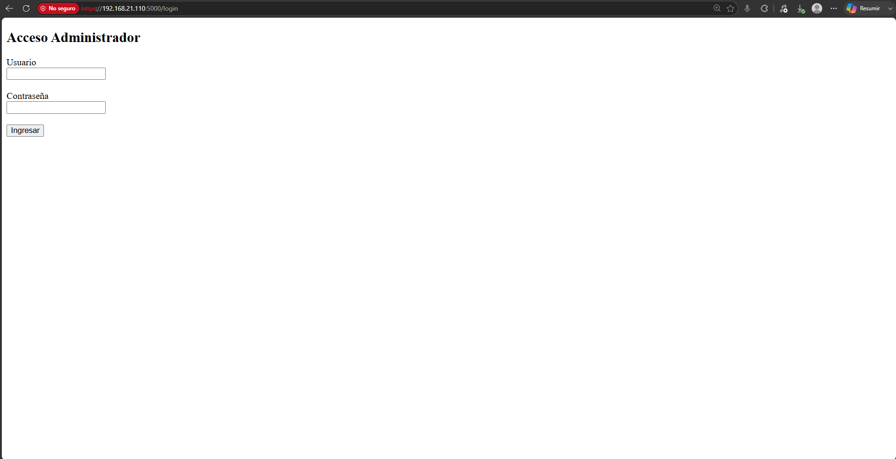
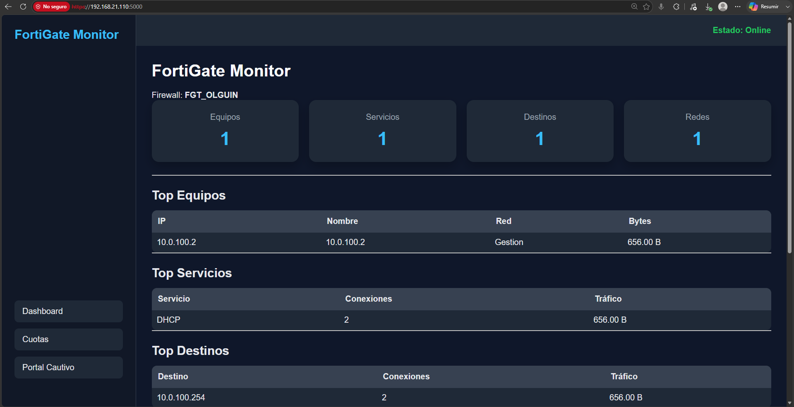
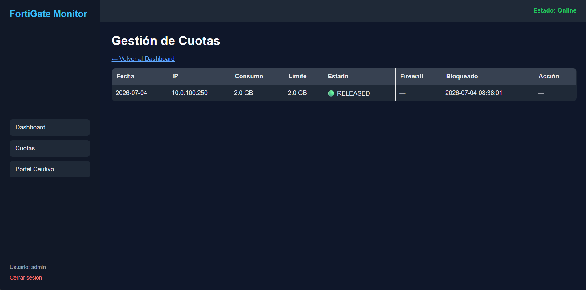

# FortiGate Monitor

Sistema web para el monitoreo y administración de dispositivos FortiGate.

---

# Descripción

FortiGate Monitor es una aplicación desarrollada en Python y Flask que permite administrar un firewall FortiGate desde una interfaz web sencilla, segura y centralizada.

El sistema recopila información del firewall, genera estadísticas de consumo, administra cuotas de navegación y facilita la gestión del Portal Cautivo, reduciendo el tiempo que un administrador dedica a tareas repetitivas.

El proyecto está diseñado para redes corporativas y uso interno por personal autorizado.

---

# Objetivos

FortiGate Monitor fue desarrollado con los siguientes objetivos:

- Centralizar la administración del FortiGate.
- Visualizar el consumo de Internet de la organización.
- Simplificar la gestión de cuotas de navegación.
- Automatizar tareas repetitivas del Portal Cautivo.
- Proporcionar una interfaz web fácil de utilizar.
- Mejorar la seguridad mediante autenticación y HTTPS.

---

# Características principales

Actualmente el sistema ofrece las siguientes funcionalidades:

- Dashboard web de monitoreo.
- Estadísticas de consumo de Internet.
- Top de equipos con mayor tráfico.
- Top de servicios utilizados.
- Top de destinos visitados.
- Consumo por redes.
- Administración de cuotas.
- Liberación de equipos bloqueados.
- Gestión del Portal Cautivo.
- Cambio individual de contraseñas.
- Cambio automático diario de contraseñas.
- Descarga de credenciales en formato CSV.
- Inicio de sesión para administradores.
- Acceso seguro mediante HTTPS.
- Integración con FortiGate mediante API REST.
- Administración mediante SSH utilizando llaves ED25519.

---

# Documentacion de produccion

Para despliegues en AlmaLinux/Rocky 9 junto a Zabbix en Apache, revisar:

- `docs/PRODUCTION_ZABBIX_ALMALINUX9.md`

Esta guia cubre reverse proxy bajo `/fortigate/`, rsyslog UDP 514, collector, SQLite, API, SSH y timer diario.

---

# Casos de uso

FortiGate Monitor puede utilizarse en diferentes entornos, por ejemplo:

- Empresas.
- Instituciones educativas.
- Clínicas.
- Hoteles.
- Oficinas corporativas.
- Redes con Portal Cautivo.
- Organizaciones que utilizan FortiGate como firewall principal.

---

# Arquitectura general

El sistema está compuesto por diferentes módulos que trabajan de forma integrada.

```text
                    Administrador

                          │
                     HTTPS (Puerto 5000)
                          │
                FortiGate Monitor (Flask)
                          │
        ┌─────────────────┼─────────────────┐
        │                 │                 │
   Dashboard         Gestión de        Portal Cautivo
                       Cuotas
        │                 │                 │
        └─────────────────┼─────────────────┘
                          │
                  FortiGate Manager
                   │               │
             REST API           SSH (ED25519)
                   │               │
                   └────── FortiGate ──────┘
```

Todos los módulos comparten una misma configuración mediante el archivo `config.yaml` y almacenan la información necesaria en una base de datos SQLite.

---

# Tecnologías utilizadas

El proyecto fue desarrollado utilizando tecnologías ampliamente soportadas y fáciles de mantener.

| Tecnología | Uso |
|------------|-----|
| Python 3.9+ | Lenguaje principal |
| Flask | Aplicación Web |
| SQLite | Base de datos |
| HTML5 | Interfaz Web |
| CSS3 | Diseño |
| JavaScript | Funciones del Dashboard |
| Chart.js | Gráficos |
| REST API | Comunicación con FortiGate |
| OpenSSH | Administración mediante SSH |
| systemd | Servicio del sistema |
| Cron | Automatización diaria |

---

# Requisitos

Para instalar FortiGate Monitor se necesita:

- Sistema operativo Linux (Rocky Linux recomendado).
- Python 3.9 o superior.
- Git.
- SQLite.
- OpenSSL.
- Acceso administrativo al FortiGate.
- API Token habilitado.
- Acceso SSH al FortiGate.

---

# Estructura del proyecto

```text
fortigate-monitor/

├── dashboard/
├── modules/
├── scripts/
├── certs/
├── docs/
├── data/
├── logs/

├── README.md
├── INSTALL.md
├── CONFIGURATION.md
├── ARCHITECTURE.md
├── SECURITY.md
├── OPERATIONS.md
├── RELEASE_NOTES.md
├── CHANGELOG.md
├── CONTRIBUTING.md
├── VERSION
├── requirements.txt
├── install.sh
└── config.yaml.example
```


---

# Documentación

La documentación del proyecto está organizada por temas para facilitar su consulta.

| Documento | Descripción |
|------------|-------------|
| README.md | Presentación general del proyecto |
| INSTALL.md | Instalación desde cero |
| CONFIGURATION.md | Configuración del sistema |
| ARCHITECTURE.md | Arquitectura y funcionamiento interno |
| SECURITY.md | Configuración y buenas prácticas de seguridad |
| OPERATIONS.md | Administración y mantenimiento diario |
| RELEASE_NOTES.md | Novedades de cada versión |
| CHANGELOG.md | Historial completo de cambios |
| CONTRIBUTING.md | Guía para colaboradores |

Cada documento tiene un objetivo específico y puede consultarse de forma independiente.

---


# Capturas de pantalla

Las siguientes imágenes muestran las principales funcionalidades del sistema.

## Inicio de sesión



---

## Dashboard



---

## Gestión de cuotas



---

## Portal Cautivo


---

# Estado del proyecto

FortiGate Monitor se encuentra en una versión estable para uso interno.

Actualmente incluye:

- Dashboard web.
- Gestión de cuotas.
- Portal Cautivo.
- Inicio de sesión para administradores.
- HTTPS.
- Integración mediante API REST.
- Administración mediante SSH con llaves públicas.
- Automatización de tareas diarias.
- Base de datos SQLite.
- Servicio administrado mediante systemd.

El proyecto está orientado a facilitar la administración diaria de dispositivos FortiGate en entornos corporativos.

---


# Roadmap

## Versión 1.7

- Exportación de reportes en PDF.
- Exportación de información a Excel.
- Filtros avanzados en el Dashboard.

## Versión 1.8

- Alertas por correo electrónico.
- Notificaciones automáticas de consumo.
- Auditoría de acciones de los administradores.

## Versión 2.0

- Administración de múltiples FortiGate.
- Alta disponibilidad.
- Integración con Active Directory o LDAP.


---

# Licencia

Este proyecto se distribuye bajo la licencia MIT.

Consulte el archivo `LICENSE` para más información.

---

# Autor

Proyecto desarrollado para la administración y monitoreo de infraestructura FortiGate en entornos corporativos.

---

# Versión

**FortiGate Monitor v1.6.1**
